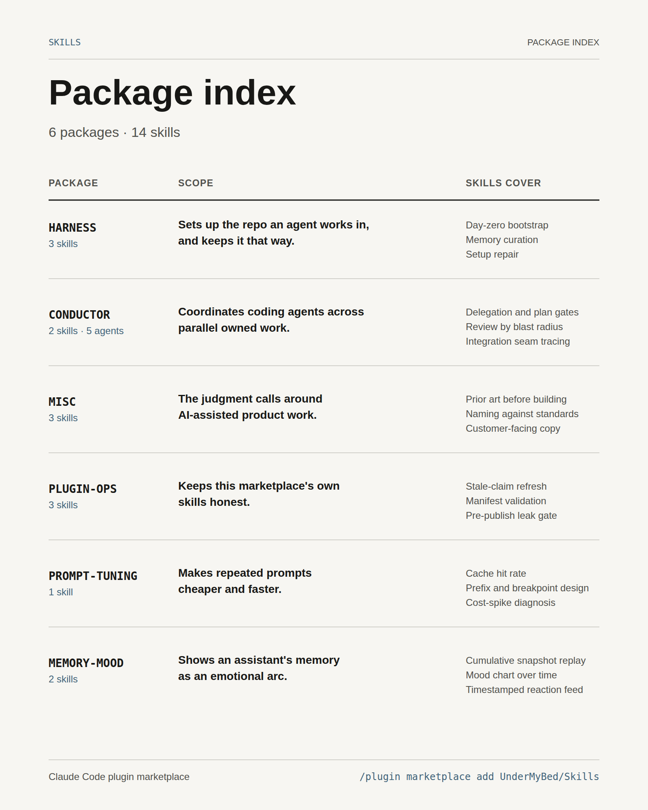

# SkillsForThings



A Claude Code skill marketplace for setting up the harness an agent works in, coordinating multi-agent builds, and the judgment calls around both.

## Install

In Claude Code:

```
/plugin marketplace add UnderMyBed/Skills
/plugin install harness@Skills
```

Or from a local clone:

```bash
claude plugin marketplace add /path/to/Skills
claude plugin install harness@Skills
```

## Plugins

### `harness`

Establish and maintain the setup an agent needs to work well in a repo — memory that holds, standing authorization, gates, and the session lifecycle. Three entry points over one shared definition of a well-formed agentic repo: install it on day zero, keep it true while you work, repair it when you come back.

| Skill | Use when |
|---|---|
| `bootstrapping-a-project` | Starting a new project or rebuild, before the first real code — the repo is empty and there is nothing to read yet |
| `curating-project-memory` | The same correction keeps recurring, a session produced something that should outlive it, or a rule that was written down is being violated anyway |
| `uplifting-agentic-setup` | Returning to a repo idle for weeks or months, or one whose setup has fallen behind the ones you work in daily |

### `conductor`

Coordinate a fleet of subagents to do what one context can't — delegate owned units, review by blast radius, trace the seams, and integrate. Ships five ready-to-delegate subagents (`implementer`, `correctness-reviewer`, `integration-gap-auditor`, `scout`, `design-steward`).

| Skill | Use when |
|---|---|
| `coordinate-agents` | A task is large enough to split across multiple subagents you coordinate as the lead, rather than doing it all in one context |
| `fan-and-critic` | A long autonomous build needs two standing outside perspectives on repeated artifacts: an enthusiast identifying what genuinely lands and a harsh critic identifying what is weak |

### `misc`

General-purpose skills for the decisions surrounding AI-assisted product work.

| Skill | Use when |
|---|---|
| `prior-art` | Before hand-rolling a capability, choosing a library, technique, or data source, or designing a custom identifier, schema, algorithm, file format, or taxonomy |
| `align-terminology` | Reviewing or designing schema field / model / enum names, or auditing names against authoritative terminology |
| `cutting-internal-leaks-from-copy` | Reviewing or writing customer-facing prose an LLM produced, to catch material that leaks the machine's internals, the build process, the author's hedging, or copy narrating its own device |

### `plugin-ops`

Skills for maintaining the marketplace itself — refreshing stale claims, validating manifests, auditing skills against current evidence.

| Skill | Use when |
|---|---|
| `refresh-skill` | A skill's content or references may have gone stale; a new SDK / model / API release may have invalidated specific recommendations |
| `admitting-a-skill` | A new or edited skill is about to enter a public marketplace, especially one ported or genericized from a private codebase — mechanical lint plus a dual-model origin-leak and quality gate |
| `framing-skill-infographics` | Deciding which reader benefit, mechanism, proof, hook, and details belong in a shareable infographic for a skill |

### `prompt-tuning`

Skills for optimizing LLM prompts across multiple axes — cache hit rate, latency, cost, structure.

| Skill | Use when |
|---|---|
| `openai-prompt-cache` | Designing or auditing OpenAI API prompts for cache hit rate; debugging cost spikes; building systems with large reused prefixes (RAG pipelines, agent loops, structured extraction, batch jobs) |

### `memory-mood`

Replays staged cumulative snapshots of your assistant's memory files in formation order and asks a fresh judge at each selected timepoint, *how do you feel?* Renders a self-contained HTML page with an emotional-arc chart and timestamped reaction feed.

| Skill | Use when |
|---|---|
| `memory-mood` | Visualizing the mood/emotional arc of your assistant's accumulating memories; free-tier (Sonnet subagents, one reading per timepoint, no API key, stdlib only) |
| `memory-mood-openai` | Same, but via the OpenAI API — k independent readings per selected snapshot, averaged with visible ±1σ call-to-call spread (requires `OPENAI_API_KEY`) |

See `AGENTS.md` for contribution conventions.

## License

MIT
