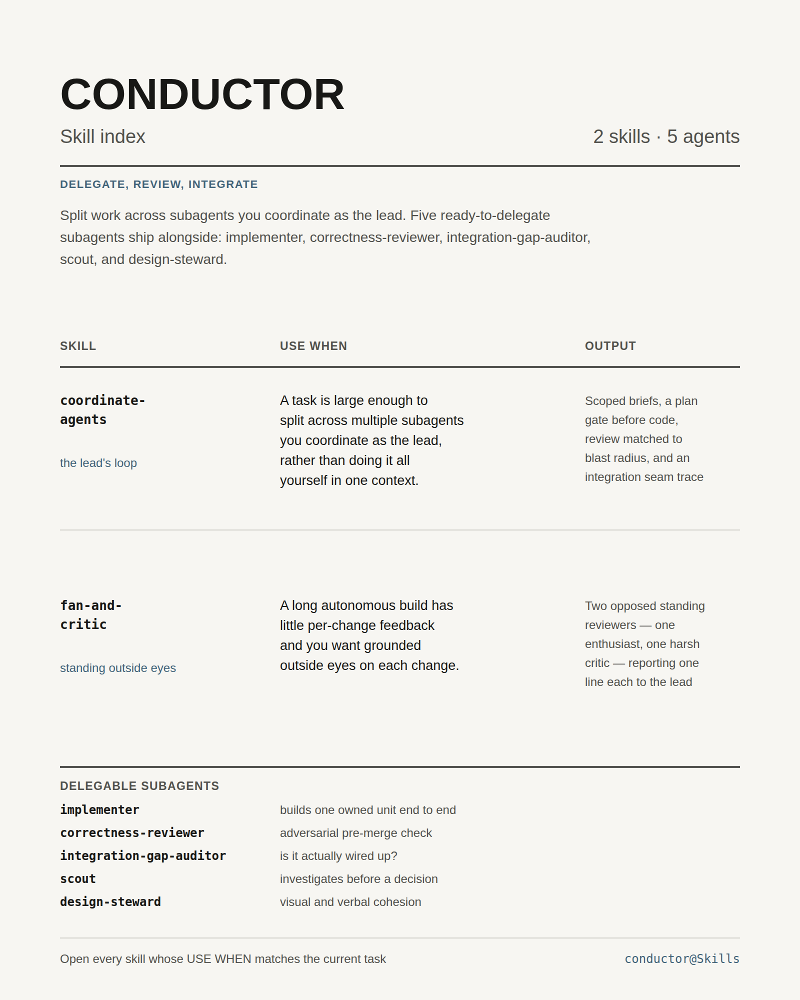

# Conductor

Skill index for coordinated AI-assisted software builds. `coordinate-agents` manages parallel owned work and integration — delegating owned units, reviewing by blast radius, and tracing the seams where they meet; `fan-and-critic` adds two standing, opposed perspectives—an enthusiast and a harsh critic—to repeated reviewable changes. Five ready-to-delegate subagents ship alongside them. Open every skill whose **USE WHEN** entry matches the current task.
