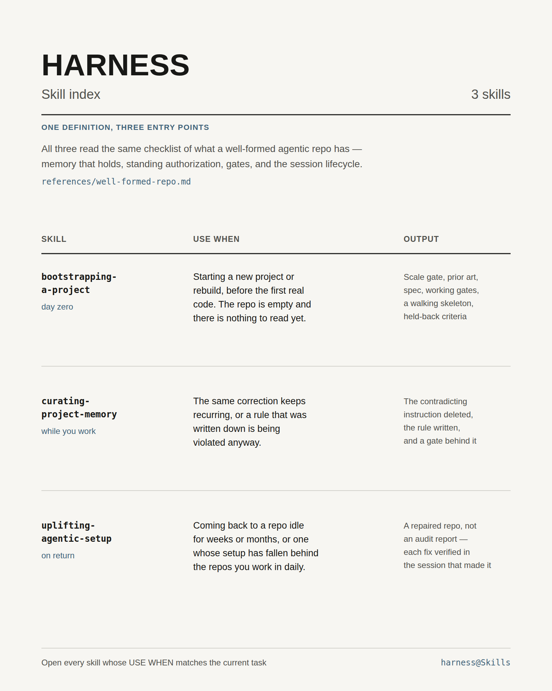

# Harness

Skill index for the setup an agent needs to work well in a repo — memory that holds, standing authorization, gates, and the session lifecycle. Three entry points over one shared definition of a well-formed agentic repo (`references/well-formed-repo.md`): `bootstrapping-a-project` installs it into an empty repo, `curating-project-memory` keeps it true while you work, `uplifting-agentic-setup` diffs and repairs it when you return. Open every skill whose **USE WHEN** entry matches the current task.
